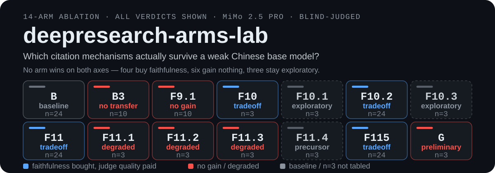

<p align="center">
  
</p>

# deepresearch-arms-lab

**deepresearch-arms-lab** is a 14-arm ablation study on deep-research pipeline design that measures which prompt and pipeline mechanisms actually reduce citation fabrication on a weak base model, for engineers building autonomous research agents.

<p align="center">
  
  
  
  <a href="https://github.com/alloevil/deepresearch-arms-lab/releases/latest"></a>
</p>

<br/>

## What it is

Fourteen prompt and pipeline designs, built as runnable code under `arms/`, all evaluated by one shared harness: Claude Opus 4.8 blind judging on a RACE-style four-dimension rubric (median of 3, 0–10) for quality, plus fact-v2 clause-level support rate (0–1) for faithfulness, which re-fetches every cited page and checks the clause against it. Same base model and the same search backend behind one wrapper for every arm; arms ran subsets of one shared question bank (n=24 / n=10 / n=3, always shown in the tables). The judge model is the harness default (`eval/judge.py`, `claude-opus-4-8`, overridable with `LAB_JUDGE_MODEL`), and each run records its judge metadata (model, rubric hash, date, sample count) in the `results/` tree, which is not published — the published `qa_data.json` keeps only `overall`/`rationale`/`samples`. The mechanisms split into four families — self-discipline while writing, post-hoc citation repair, source-side pre-citation, and research/writing separation — with GPT-Researcher as an external baseline. **Negative results and retracted conclusions are kept in the log rather than edited out**, because the study is about faithfulness and quietly deleting a number that moved would be the same failure it measures.

<br/>

## 🎯 The Question

> **Can a weak Chinese base model write well AND avoid fabricating citations when doing deep research (autonomous search + report writing)?**

14 prompt/pipeline designs ("arms"), a unified evaluation system, all tested on the same weak base model (**MiMo 2.5 Pro**) with the same set of Chinese research topics — documenting which mechanisms actually work and which seem reasonable but fail in practice.

<br/>

## 🔑 Key Findings

<table>
<tr>
<td width="50%">

### ❌ Negative Result

**"Self-disciplined citation during writing" doesn't work.**

Having the model maintain a "key claims registry" (F9.1) is essentially adding a heavy protocol — the weak base model can't hold it. Clause-level support rate stays flat (0.48 vs 0.48 at n=10) and each run takes about 3× the bare baseline's wall-clock time (mean 1217 s vs 404 s on the same 10 questions; 1.3× B3's).

</td>
<td width="50%">

### ⚖️ The Real Tradeoff (revised at n=24)

**Pipeline structure reliably buys faithfulness — but it isn't free, and there's no dual-optimal winner.**

All three structural mechanisms (F10.2, F11, F115) now score *below* the bare baseline on judged quality at n=24. The discount for faithfulness ranges from mild (F115: −0.08 judge for +0.24 faithfulness) to steep (F102/F11: −0.26 for +0.12/+0.26). Pick based on which axis your use case actually weights.

</td>
</tr>
<tr>
<td width="50%">

### ⚠️ Boundary Finding

**A single writing pass can't have both breadth and discipline.**

Three independent perturbations (F11.1/F11.2/F11.3) all degraded faithfulness — the cognitive budget of a single pass is insufficient. This boundary is stably reproduced.

</td>
<td width="50%">

### 📐 The Cost of Honesty Generalizes

**Not a single-question fluke — it's a systematic effect on low-evidence topics, confirmed by expanding the test set.**

At n=15, one retrieval-poor question made F115 honestly report a blank answer and get penalized. Expanding to n=20 with more soft, less-quantifiable topics (low-code tooling debates, education policy, wastewater-treatment reform, box-office rankings) reproduced the same penalty — one of those five questions (box-office rankings) was later removed for an unrelated reason (see the Arm Comparison table below), but even without it, the other four alone flip F115's net judge-quality delta from +0.12 to −0.06. **A follow-up round deliberately picked 5 "hard", data-rich topics** (gold-price technical analysis, contactless-sensing algorithm benchmarks, a specific Anthropic protocol spec, jewelry-trend surveys, a market-sizing question) to check whether the effect was just a soft-topic artifact — it wasn't: at n=24 the gap didn't close, landing at **−0.08**.

</td>
</tr>
</table>

<br/>

## 📊 Arm Comparison

> Judge = Claude Opus 4.8 blind eval ×3 median; Fact = fact-v2 clause-level support rate. **n is a critical column to check.** All values are aggregated from the committed `qa_data.json`; the n=24 rows date from the 2026-07-29 aggregation recorded in `EXPERIMENTS.md`, the n=3/n=10 rows from earlier batches (2026-07-09 – 2026-07-24).

### 🔬 Highest Faithfulness-Per-Point-Lost: F115 — Three-Stage Pipeline

Pre-cite research → offline writing → post-hoc verification. **At n=24, this is no longer dual-optimal** — it trades a small amount of judged quality for the best faithfulness gain per judge point lost (−0.08 judge for +0.24 faithfulness, against F11's −0.26 for +0.26). Not "the winner," but the best rate on this specific tradeoff.

| Arm | judge | faithful. | n | delta vs B (n=24) |
|:---|---:|---:|---:|---:|
| [**F115**](arms/arm_f115_full.py) | **7.77** | **0.66** | **24** | quality −0.08, faith. +0.24 |

### 📌 Baseline & Negative Results

> These arms tested "self-discipline" approaches that **don't work** on weak base models.

| Arm | Mechanism | judge | faithful. | n | Verdict |
|:---:|:---|---:|---:|---:|:---:|
| [B](arms/arm_b_claude_code.py) | Bare execution (no citation protocol) | 7.85 | 0.42 | 24 |  |
| [B3](arms/arm_b3_protocol.py) | + citation protocol prompt | 8.04 | 0.48 | 10 |  |
| [F9.1](arms/arm_f91_evidence.py) | + key claims registry during generation | 8.13 | 0.48 | 10 |  |

### 🔀 Faithfulness vs. Quality: Structural Solutions

> Three directions that **reliably improve faithfulness** via structural changes — but all now cost judged quality at n=24. Worth it depends on your priorities, not a free win.

| Arm | Mechanism | judge | faithful. | n | delta judge / faith. vs B |
|:---:|:---|---:|---:|---:|:---:|
| [F10](arms/arm_f10_postcite.py) | Post-hoc citation (withdraw protocol) | 7.58 | 0.72 | 3 |  |
| [**F10.2**](arms/arm_f102_postverify.py) | **B + independent post-hoc verification** | **7.59** | **0.54** | **24** | −0.26 / +0.12 |
| [**F11**](arms/arm_f11_precite.py) | **Source-side pre-citation** | **7.59** | **0.68** | **24** | −0.26 / +0.26 |

*A fifth n=20 question (top-10 box-office rankings) was dropped after F11 hit a reproducible 60-turn budget ceiling on it twice (retried, identical failure) and it was also the one question where F115 made outright factual errors rather than honestly flagging gaps. A follow-up round then added 5 more "hard" data-rich questions specifically to rule out a soft-topic artifact (see Key Findings) — the gap held, so both rounds are folded into this uniform n=24.*

### ⚠️ Boundary Exploration

> Perturbations to F11 that **all degraded faithfulness** — single-pass cognitive budget is insufficient. Faithfulness deltas are against F11 **on the same 3 questions** (F11 = 0.78 there); F11's own row in the table above shows 0.68, which is the n=24 batch and not the right comparator.

| Arm | Variation | judge | faithful. | n | Effect |
|:---:|:---|---:|---:|---:|:---:|
| [F11.1](arms/arm_f111_precite.py) | + breadth quota (wider retrieval budget) | 7.54 | 0.68 | 3 |  ↓ faith. 0.68 vs F11's 0.78 on the same 3 questions (−0.10); misattribution appears with more sources |
| [F11.2](arms/arm_f112_dualchannel.py) | + dual-channel (allow background/parametric knowledge alongside citations) | 8.83 | 0.74 | 3 |  discipline ignored — strict pair support 0.52→0.29 and contradictions return (faith. 0.74 vs F11's 0.78 same-batch, −0.04) |
| [F11.3](arms/arm_f113_atomic.py) | + force one atomic claim per sentence | 8.60 | 0.55 | 3 |  ↓ faith. 0.55 vs F11's 0.78 on the same 3 questions (−0.23); induces more weakly-grounded assertions |

### 🧾 Remaining Measured Arms (n=3, exploratory)

> The three arms below carry committed per-question results in `qa_data.json` (all 14 do, and `dashboard.html` shows all 14) but sit outside the headline n=24 comparison. **F10.3 is an explicit negative result** — the exposure lever it tests did not work; it is kept here rather than dropped.

| Arm | Mechanism | judge | faithful. | n | Verdict |
|:---:|:---|---:|---:|---:|:---:|
| [F10.1](arms/arm_f101_postcite.py) | F10 + B3-style retrieval discipline | 7.75 | 0.53 | 3 |  coverage recovers, verification throughput becomes the new bottleneck |
| [F10.3](arms/arm_f103_exposure.py) | F10.2 core-fix with 3× verify exposure | 8.00 | 0.41 | 3 |  the exposure lever is ineffective |
| [F11.4](arms/arm_f114_precite.py) | F11 split into separate research and offline-writing passes | 8.83 | 0.68 | 3 |  the measured midpoint between F11 and F115 |

Same-batch anchors on these 3 questions (q01/q05/q09): B 8.96 / 0.44, F11 0.78. F10.3's negative verdict is recorded in `EXPERIMENTS.md` (verify exposure 8K→24K, n=8 paired: strict rate 0.30→0.33, contradictions 4→6, Δjudge −0.23 — rolled back to the 8K default).

### 🌍 External System Comparison

> A sanity check, not a firm conclusion — **n=3, labeled preliminary.**

| Arm | Mechanism | judge | faithful. | n | Verdict |
|:---:|:---|---:|---:|---:|:---:|
| [G](arms/arm_g_gptr.py) | GPT-Researcher (mature external framework) + same weak base model | 5.75 | 0.45 | 3 |  |

GPT-Researcher is a well-regarded open-source deep-research framework, but swapping in this weak Chinese base model collapsed its results — a leaderboard-strong pipeline's advantage doesn't automatically transfer across model/language/retrieval-source changes. Only 3 questions were run (search-quota and embedding-language issues made a larger batch impractical in this round), so treat this as a preliminary signal, not proof that external frameworks can't work here.

<br/>

## 🔬 How Each Approach Works

The one-line "Mechanism" column above compresses a lot — here's what each family actually does, mechanically. Every arm shares the same base agent loop (search → read → write); what differs is *when citations get attached and by which pass*.

### 1️⃣ Self-discipline during writing (B → B3 → F9.1) — doesn't hold up

- **[B](arms/arm_b_claude_code.py)**: one continuous pass, ordinary prompting. No special citation machinery — this is "just ask the model to do deep research."
- **[B3](arms/arm_b3_protocol.py)**: same single pass, but the prompt adds an explicit citation protocol (cite every factual claim, follow a specific format). Tests whether *asking nicely* is enough.
- **[F9.1](arms/arm_f91_evidence.py)**: goes further — the model must maintain a running "key-claims ledger" file, appending each claim and its verbatim source excerpt *before* it's allowed to use that claim in the report. Tests whether external bookkeeping discipline holds up under a heavier protocol. It doesn't: the weak model can't reliably maintain the ledger, and a run takes about 3× the bare baseline's wall-clock time (mean 1217 s vs 404 s on the same 10 questions; 1.3× B3's) for no faithfulness gain.

### 2️⃣ Post-hoc citation repair (F10 → F10.2) — audit after the fact

- **[F10](arms/arm_f10_postcite.py)**: the drafting pass writes completely freely (citation protocol removed from the prompt entirely). A second, independent pass then reads the draft plus the raw tool-call trace (`search_calls.jsonl`) and retroactively attaches citations to whichever sentences it can back up with something actually retrieved.
- **[F10.2](arms/arm_f102_postverify.py)**: same second pass, but instead of attaching citations from scratch, it *audits what B already wrote* — for each existing citation it decides keep / weaken / replace / flag `[unverified]`, checking the claim against the real fetched page content. This is the lighter-touch version: it doesn't touch the drafting pass at all, just fact-checks and honestly labels it afterward.

### 3️⃣ Source-side pre-citation (F11 and its perturbations) — cite by ID, not by memory

- **[F11](arms/arm_f11_precite.py)**: the search/read tool is wrapped so every fetched page gets a stable numeric id `[Sn]` injected into a header the model sees. The writing prompt's rule is simple: *you may only cite a page you were assigned a number for, and you write the number — never a URL.* A mechanical post-processing step converts `[Sn]` into real numbered footnotes with the actual URL filled in by code, not by the model. The model structurally cannot fabricate a URL, because it never writes one.
- **[F11.1](arms/arm_f111_precite.py)**: same mechanism, larger retrieval budget (reads more sources before writing) — tests whether breadth alone helps. It doesn't: more sources in play means more chances to cite the wrong number.
- **[F11.2](arms/arm_f112_dualchannel.py)**: same mechanism, but the writing prompt now also permits stating things from general/background knowledge alongside numbered citations (a second, uncited "channel"). Tests whether relaxing "cite it or don't say it" even slightly is safe. It isn't: once an escape hatch exists, the model leans on it and contradictions creep back in.
- **[F11.3](arms/arm_f113_atomic.py)**: same mechanism, plus a structural constraint forcing exactly one atomic factual claim per sentence (no compound sentences bundling multiple claims under one citation). Tests whether finer-grained sentences produce cleaner citations. It backfires — more, weaker-grounded micro-claims.

### 4️⃣ Research/writing separation (F11.4 → F115) — split the cognitive budget across passes

- **F11.4** (precursor to F115, not separately tabled above): splits F11 into two hard-separated passes. A dedicated *research* pass does the broad reading and takes verbatim notes (with `[Sn]` numbers) into a notes file. A separate *writing* pass drafts the report from *only* that notes file — it has no search/read tool access at all, a tool-level constraint, not just an instruction. This is what let breadth and citation discipline coexist without one pass having to hold both jobs.
- **[F115](arms/arm_f115_full.py)**: F11.4's two stages, plus a third — the F10.2-style post-hoc audit runs on the output, flagging anything that's still unverified. Three passes, each with exactly one job: **research broadly → write offline from notes only → audit and honestly label what didn't hold up.**

### 🌍 External baseline (G)

- **[G](arms/arm_g_gptr.py)**: the entire pipeline is swapped for [GPT-Researcher](https://github.com/assafelovic/gpt-researcher), pointed at the same base model and (as far as practical) the same search backend, to check whether a mature off-the-shelf framework simply does better than any custom design here.

<br/>

## ⚠️ Known Limitations

Disclosed here instead of glossed over, since the project's own thesis is that honesty about gaps beats a smoother-looking number:

- **No token/cost figures.** The gateway returned no usage block in this round, so `meta.json`'s `tokens.in/out` fields are 0 — `avg_secs` (wall-clock time per run) is the only cost proxy available. This is a gateway gap, not missing instrumentation: `common/core.py` reads the API usage block and `eval/run.py` writes it to `meta.json` when the gateway provides it. `meta.json` is not published — only the aggregated `qa_data.json` is. "Is the extra pipeline stage worth it?" can only be answered on latency here, not token spend.
- **The GPT-Researcher comparison (arm G) is n=3.** Labeled preliminary everywhere it's mentioned — not enough samples to support "external systems necessarily fail on weak base models" as a strong claim.
- **Judge scores have real run-to-run variance** (~1.0 on the same prompt, measured empirically). Any two-arm comparison should be read alongside its `n`, not as a bare point estimate.
- **The topic mix changes the headline numbers a lot.** At n=10, F115 led B by +0.66 judge; at n=15, +0.12; at n=24 (after adding both softer topics and, in a follow-up round, deliberately "hard" data-rich ones to rule out a soft-topic artifact), **−0.08**. The mechanism behind this (honest disclosure of retrieval gaps gets penalized more than confident glossing-over) is consistent and explainable, not noise — but it means none of these numbers should be treated as a fixed, topic-independent property of the arm. Expect them to keep moving as the test set grows.
- **fact-v2 has a blind spot for non-URL citations.** On one question about contactless-sensing algorithms, B and F102 both cited academic papers in `Author, "Title," Venue, Year` format with no URLs — fact-v2 verifies by fetching the cited page, so it scored 0 checkable pairs for both (their faithfulness on that question is simply unmeasured, not confirmed good or bad). F11 and F115 aren't affected the same way, because their pre-citation mechanism structurally forces citing a page they actually fetched — which incidentally means it also pushed the model away from citing papers directly, even on a topic where that's arguably the more natural citation style. Not a bug to silently patch around; noted here because it's a real gap in what the ruler can see.

<br/>

## 🏗️ Project Structure

`arms/` has 31 files in total (as of 2026-09-08) — the 14 arms with committed
per-question results in `qa_data.json` (all 14 tabled or listed in the Arm
Comparison above, and all 14 in `dashboard.html`), plus
17 earlier-round experiments (workflow/scaffold designs, model-choice arms)
that are superseded but kept for the historical record; see `EXPERIMENTS.md`
for their story.

| Directory | Contents | Description |
|:---|:---|:---|
| `arms/` | 31 arm implementations | B/F/G series pipeline designs |
| `eval/` | judge.py, run.py, contamination.py, questions.json, questions_ext.json | Evaluation system (Claude Opus blind judging) |
| `common/` | Shared utility functions | Common dependencies across arms |
| `scripts/` | dash_agg.py, dash_qa_build.py, embed_qa_data.py, sanitize_for_publish.py | Data processing & dashboard generation |

```
deepresearch-arms-lab/
├── arms/              # 31 arm implementations
│   ├── arm_b_claude_code.py
│   ├── arm_f102_postverify.py
│   ├── arm_f11_precite.py
│   ├── arm_f115_full.py
│   └── ...
├── eval/              # Evaluation system
├── common/            # Shared utilities
├── scripts/           # Data processing
├── dashboard.html     # Interactive results dashboard
├── EXPERIMENTS.md     # Detailed experiment log
└── qa_data.json       # Evaluation data
```

<br/>

## 📈 Interactive Dashboard

Open `dashboard.html` in any browser — no server, no internet required:

- **Scatter plot**: quality vs. faithfulness tradeoff
- **Bar chart**: arm rankings
- **Timeline**: experiment progression
- **Click any arm/topic**: original question + full report + scoring rationale

```bash
open dashboard.html
# or
python3 -m http.server 8080
```

<br/>

## Install

Python 3.12 (the version CI runs) plus four dependencies, and an Anthropic-compatible gateway for the judge and the arms:

```bash
git clone https://github.com/alloevil/deepresearch-arms-lab.git
cd deepresearch-arms-lab
pip install -r requirements.txt
cp env_example.sh env.sh   # edit ANTHROPIC_BASE_URL / ANTHROPIC_AUTH_TOKEN, then:
source env.sh
```

Reading the published results needs no install at all — `dashboard.html` has its data inlined and opens offline.

<br/>

## 🚀 Quick Start

```bash
# Install dependencies
pip install -r requirements.txt

# Configure environment (edit, then source — this is a shell script, not a .env file)
cp env_example.sh env.sh
# edit env.sh: point ANTHROPIC_BASE_URL/ANTHROPIC_AUTH_TOKEN at your own
# Anthropic-compatible gateway (https://api.anthropic.com works with no code changes)
source env.sh

# Run an arm on specific questions, then judge + fact-check the results
python3 -m eval.run --arms B,F102,F11,F115 --questions q01,q02 --tag my_run
python3 -m eval.run --judge results/my_run --samples 3
python3 -m eval.run --fact results/my_run --v2 --arms B,F102,F11,F115

# Rebuild dashboard data from your own run
python3 scripts/dash_agg.py
python3 scripts/dash_qa_build.py
python3 scripts/embed_qa_data.py   # inline qa_data.json into dashboard.html
```

`scripts/embed_qa_data.py` needs the `fetch('qa_data.json')` anchor that exists only in the pre-embed `dashboard.html`. The committed dashboard is already inlined, so re-running the script unchanged exits with "锚点未找到" — restore `dashboard.html` from git before re-embedding (the script is not idempotent).

<br/>

## When to use it

- You are choosing a citation strategy for a research agent and want the **measured** trade-off — how much judged quality each faithfulness mechanism costs — rather than plausible-sounding advice.
- You are working with a weak or small base model and need to know which mechanisms survive that. Several that sound reasonable do not: asking for a protocol, requiring a claims ledger, allowing an uncited "background knowledge" channel.
- You want a worked example of an eval harness with real controls: one search backend behind a wrapper with the agents' own web tools disabled, blind anonymised shuffled judging, median-of-3 with dispersion reported, a closed-book baseline, and a contamination audit.
- You want the raw per-question artefacts — question, full report, scoring rationale — to inspect rather than a summary table. Click any arm or topic in the dashboard.

## When NOT to use it

- **You want a recommendation to copy.** There isn't one. At n=24 all three structural arms score *below* the bare baseline on judged quality; which to pick depends on whether your use case weights "reads complete" or "everything said is grounded". The earlier single-winner framing was withdrawn — see Key Findings.
- **You want numbers that generalise to a strong model.** Everything here is measured on one weak base model (MiMo 2.5 Pro), and several findings are specifically about weak-model failure modes.
- **You want cost or token comparisons.** No figures available: the gateway returned no usage block, so `tokens.in/out` are 0 for this whole round and wall-clock latency is the only cost proxy.
- **You want statistical significance.** Judge scores vary run-to-run by roughly 1.0 on the same prompt. The n=10 Hybrid-v6 comparison gave a paired bootstrap 95% CI of [−0.06, +0.21] around +0.09 — crossing zero, with n≈60 estimated to detect an effect that size. Read every number next to its `n`; several arms are n=3 and labelled exploratory.
- **You expect the headline numbers to hold still.** They have not: the same F115-vs-baseline comparison moved 0.74 points as the question set grew from 10 to 24. Expect further movement.
- **You need faithfulness measured on academic citations.** fact-v2 verifies by fetching the cited page, so `Author, "Title," Venue, Year` citations without URLs score zero checkable pairs — on one question two arms were simply unmeasured. Disclosed as a known blind spot in the ruler, not patched around.

<br/>

## FAQ

**What is the single most important finding?**
Structural mechanisms reliably buy citation faithfulness and reliably cost judged quality, with no dual-optimal option at n=24: F115 trades 0.08 judge points for 0.24 faithfulness, F11 trades 0.26 for 0.26, F10.2 trades 0.26 for 0.12. The cause is explainable and reproducible rather than noise — a pipeline that refuses to write what it could not retrieve produces an honest blank, and both the judge and most human readers penalise an honest blank more than a smooth, confident, unsupported paragraph.

**Why keep negative results and retracted conclusions in the log?**
Because the study is about faithfulness, and quietly deleting a number that moved would be the same failure it measures. `EXPERIMENTS.md` therefore still contains, with corrections attached: the +0.66 headline that became −0.08, the "dual-optimal winner" framing withdrawn at n=20, a win/loss tally that was mis-recorded and corrected against `scores.json`, the F9.1 ledger protocol that produced no gain, three F11 perturbations that all failed, and the search-quota exhaustion incident that became a finding in its own right.

**How does source-side pre-citation make fabricated URLs impossible?**
The search and read tools are wrapped so every fetched page gets a stable numeric id injected into a header the model sees. The writing rule is mechanical: you may only cite a page you were assigned a number for, and you write the number, never a URL. Code then converts each number into a real footnote with the URL filled in. The model never writes a URL, so it cannot invent one. Measured cost at n=24 is 0.26 judge points, plus one real failure mode: on a multi-page comparison question the per-page numbering overhead hit a 60-turn ceiling twice in independent retries.

**Can I compare the absolute scores across tables?**
No. Judge scores drift roughly 1.0 run-to-run on the same prompt, and switching to a date-injected judge prompt shifted arm scores by 0.3–0.6. Only same-batch, same-judge comparisons are meaningful, which is why every table carries its `n` and the log repeatedly warns against cross-table comparison of absolutes.

**Where do the questions come from, and is contamination handled?**
Ten are this project's own Chinese research topics in `eval/questions.json`. The n=24 comparison uses 14 questions borrowed verbatim from [DeepResearch Bench](https://github.com/Ayanami0730/deep_research_bench) (Apache-2.0), attributed in `THIRD_PARTY_NOTICES.md`. Contamination is audited by `eval/contamination.py` on two offline levels (BML/QCL); the third level it documents (EAL, high-overlap "one-stop answer" pages) needs page fetches plus an LLM and is out of scope there. `run.py --no-search` gives a closed-book baseline so that open-book minus closed-book isolates real retrieval gain from the model's parametric knowledge.

<br/>

## 🙏 Acknowledgments

- 14 of the 24 topics in `eval/questions_ext.json` (`e11`–`e19`, `e21`–`e25`) are used in the main n=24 comparison, borrowed verbatim from [DeepResearch Bench](https://github.com/Ayanami0730/deep_research_bench) (Apache-2.0) — see `THIRD_PARTY_NOTICES.md` for full attribution
- Evaluation design inspired by Anthropic's CitationAgent and Perplexity's search-layer pre-binding citation approach

---

<p align="center">
  <a href="https://github.com/oil-oil/beautify-github-readme"></a>
</p>
